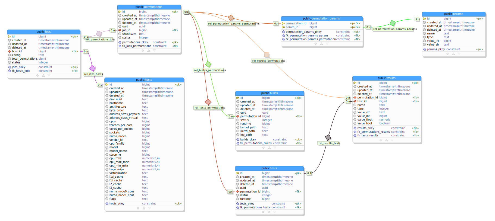

# wayfinder: OS Configuration Micro-Benchmarking Framework

Wayfinder is a generic OS performance evaluation platform.  Wayfinder is fully
automated and ensures both the accuracy and reproducibility of results, all the
while speeding up how fast tests are run on a system. Wayfinder is easily
extensible and offers convenient APIs to:

 1. Implement custom configuration space exploration techniques,
 2. Add new benchmarks; and,
 3. Support additional OS projects.

Wayfinder's capacity to automatically and efficiently explore a LibOS' can be
found in the [examples/](examples/) directory; as well as its ability to
efficiently isolate parallel experiments to avoid noisy neighbors.

## Configuration

New jobs are described using a configuration YAML file.

### Parameterization configuration

| Attribute   | Required | Definition                                                                                                 |
|-------------|----------|------------------------------------------------------------------------------------------------------------|
| `name`      | Yes      | The name of the variable.  This will be the same as the environmental argument passed to a `run` instance. |
| `type`      | Yes      | The variable type, one of: [`integer`, `string`].                                                          |
| `min`       | No       | Starting `integer` value.                                                                                  |
| `max`       | No       | Ending `integer` value.                                                                                    |
| `step`      | No       | How much to increment `integer` value by.  Default is `1`.                                                 |
| `step_mode` | No       | Whether to step by `increment` or by `power`.  When `power`, the `step_mode` is used as the base.          |
| `only`      | No       | Discrete list of values to vary the parameter by.                                                          |

#### Examples

1. Integer, min-max, static increment: `[1, 2, 3, 4, 5]`
   ```yaml
   params:
     - name: A
       type: integer
       min: 1
       max: 5
       step: 1
   ```

2. Integer, min-max, power increment: `[1, 2, 4, 8, 16]`
   ```yaml
   params:
     - name: B
       type: integer
       min: 1
       max: 16
       step: 2
       step_mode: power
   ```

3. Integer, fixed set: `[1, 20, 100]`
   ```yaml
   params:
     - name: C
       type: integer
       only: [1, 20, 100]
   ```

4. String, fixed set: `["hello", "world"]`
   ```yaml
   params:
     - name: D
       type: string
       only: ["hello", "world"]
   ```

When parameters A and B are used (seen above), the following permutation matrix
will be run via wayfinder:

|  # | `C`   | `D`     |
|----|-------|---------|
|  1 | `1`   | `hello` |
|  2 | `1`   | `world` |
|  3 | `20`  | `hello` |
|  4 | `20`  | `world` |
|  5 | `100` | `hello` |
|  6 | `100` | `world` |

### Build configuration

Wayfinder is split into two main operations: builds and tests.  Builds are
operations which construct a kernel image and init ram.  A job's build can be
specified with the following additional YAML attributes:

| Attribute        | Required | Description                                                             |
| ---------------- | -------- | ----------------------------------------------------------------------- |
| `image`          | Yes      | Remote OCI image for the filesystem to use for the build.               |
| `outputs.kernel` | Yes      | The path to the resulting kernel image.                                 |
| `outputs.initrd` | Yes      | The name of the resulting initrd.                                       |
| `outputs.arch`   | No       | The architecture the kernel targets.                                    |
| `outputs.plat`   | No       | The paltform the kernel targets.                                        |
| `devices`        | No       | List of additional devices to attach from the host to the build instance. |
| `capabilities`   | No       | List of capabilities the OCI filesystem should have access to.          |
| `cores`          | No       | Number of cores to allocate the build instance.  Default is `1`.        |
| `commands`       | Yes      | The commands to run within the OCI image to complete the build.         |

All parameters defined in the YAML configuration are provided to a `build` as
environmental variables.  The `build` directive can use a remote OCI image for
creating a flesystem with the needed dependencies of the action, for example:

```yaml
build:
  image: ghcr.io/unikraft/wayfinder/fakebuild:latest
  outputs:
    kernel: /build/nginx_kvm-x86_64
    initrd: /build/initramfs.cpio
    arch: x86_64
    plat: kvm
  devices:
    - /dev/urandom
  capabilities:
    - CAP_NET_ADMIN
  cores: 1
  commands:
    |
    set -xe
    env
```

### Test configuration

| Attribute                | Required | Description                                                                                                                                     |
| ------------------------ | -------- | ----------------------------------------------------------------------------------------------------------------------------------------------- |
| `kernel.memroy`          | Yes      | The amount of memory to give the kernel.                                                                                                        |
| `kernel.args`            | Yes      | The "command line" arguments to pass to the kernel.  We provide additional utility variables listed [below](#automatic-command-line-variables). |
| `kernel.cores`           | Yes      | Number of cores to allocate the test kernel instance.  Default is `1`.                                                                          |
| `benchtool.devices`      | No       | List of additional devices to attach from the host to the run instance.                                                                         |
| `benchtool.capabilities` | No       | List of capabilities the OCI filesystem should have access to.                                                                                  |
| `benchtool.commands`     | Yes      | The commands to run within the OCI image to complete the test.                                                                                  |
| `benchtool.cores`        | Yes      | Number of cores to allocate the test benchmark tool.  Default is `1`.                                                                           |
| `benchtool.start_delay`  | No       | An optional "warm up period" to be used as a delay between starting the kernel and running the benchmark tool.                                  |
| `results[].name`         | Yes      | A series of results which come from a successful test.  This is the name of the result.                                                         |
| `results[].path`         | Yes      | A path to the location where the result is saved within the OCI filesystem after a successful test.                                             |
| `results[].type`         | Yes      | The result type, one of `[` `int`, `str`, `float`, `bool` `]`.                                                                                  |

```yaml
test:
  kernel:
    memory: 10M
    args: netdev.ipv4_addr=$WAYFINDER_DOMAIN_IP_ADDR netdev.ipv4_gw_addr=$WAYFINDER_DOMAIN_IP_GW_ADDR netdev.ipv4_subnet_mask=$WAYFINDER_DOMAIN_IP_MASK --
    cores: 1
  benchtool:
    image: ghcr.io/unikraft/wayfinder/wrk:latest
    devices:
      - /dev/urandom
    capabilities:
      - CAP_NET_ADMIN
    commands: /test.sh
    cores: 1
    start_delay: 5
  results:
    - name: throughput
      path: /results/throughput.txt
      type: float
```

#### Automatic command-line variables

A number of special variables can be used in the `kernel.args` parameter of a
`test` directive which will be automatically replaced before the domain is
launched.  These include:

| Variable                       | Description                                                                                 |
| ------------------------------ | ------------------------------------------------------------------------------------------- |
| `$WAYFINDER_DOMAIN_IP_ADDR`    | The IP address which has been allocated by Wayfinder to the test kernel, e.g. `172.88.0.2`. |
| `$WAYFINDER_DOMAIN_IP_GW_ADDR` | The gateway address, e.g. `172.88.0.1`                                                      |
| `$WAYFINDER_DOMAIN_IP_MASK`    | The full subnet mask of the of the gateway, e.g. `255.255.255.0`.                           |

## Getting started and usage

### Daemon and Server

To get started using wayfinder, download the [latest
release](https://github.com/unikraft/wayfinder/releases) and install on your
host system.  Once installed, you can can launch the Wayfinder daemon
(`wayfinderd`) as a CLI program:

```
Wayfinder is a generic OS performance evaluation platform.  Wayfinder is fully
automated and ensures both the accuracy and reproducibility of results, all the
while speeding up how fast tests are run on a system. Wayfinder is easily
extensible and offers convenient APIs to:

  - Implement custom configuration space exploration techniques,
  - Add new benchmarks; and,
  - Support additional OS projects.

Usage:
  wayfinderd -c wayfinderd.yaml
  wayfinderd [command]

Available Commands:
  completion  generate the autocompletion script for the specified shell
  help        Help about any command

Flags:
  -c, --config string   config file (default "wayfinderd.yaml")
  -h, --help            help for wayfinderd
  -V, --version         Show version and quit

Use "wayfinderd [command] --help" for more information about a command.
```

`wayfinderd` supports gRPC and HTTP requests and is manipulated generally via
the client-side program [`wfctl`](#wfctl).  A sample configuration for the
daemon server can be found in [`config/`](/config/wayfinderd.yaml).

### `wfctl`

To manipulate Wayfinder; to create jobs and start job permutaiton evalutions,
use the command-line client `wftctl`:

```
wayfinder: OS Configuration Micro-Benchmarking Framework

Usage:
  wfctl
  wfctl [command]

Available Commands:
  completion  generate the autocompletion script for the specified shell
  create      Create a new job to be executed by the wayfinder server.
  help        Help about any command
  start       Start a job on the wayfinder server.

Flags:
  -h, --help            help for wfctl
  -w, --server string   Remote path to wayfinder gRPC server (default "localhost:5000")
  -v, --verbose         Enable verbose logging
  -V, --version         Show version and quit

Use "wfctl [command] --help" for more information about a command.
```

#### Creating a job

```
Create a new job to be executed by the wayfinder server.

Usage:
  wfctl create [OPTIONS...] FILE

Aliases:
  create, cj

Flags:
  -h, --help   help for create

Global Flags:
  -w, --server string   Remote path to wayfinder gRPC server (default "localhost:5000")
  -v, --verbose         Enable verbose logging
  -V, --version         Show version and quit
```

#### Starting a job

```
Start a job on the wayfinder server.

Usage:
  wfctl start [OPTIONS...] ID

Aliases:
  start, sj

Flags:
  -h, --help                    help for start
  -i, --isol-level none         Specify the level of isolation for job permutations. (default none)
  -x, --isol-split both         Specify the split of isolation for job permutations. (default both)
  -l, --permutation-limit int   Number of permutations to iterate over before stopping.  Zero means all.
  -s, --scheduler grid          Specify the scheduler for job permutations. (default grid)

Global Flags:
  -w, --server string   Remote path to wayfinder gRPC server (default "localhost:5000")
  -v, --verbose         Enable verbose logging
  -V, --version         Show version and quit
```

## Database Overview



Below is a description of each table and its intended purpose.

| Table                | Description                                                                                                                                                                                                                                                                                                                                                                                                                                                          |
| -------------------- | -------------------------------------------------------------------------------------------------------------------------------------------------------------------------------------------------------------------------------------------------------------------------------------------------------------------------------------------------------------------------------------------------------------------------------------------------------------------- |
| `hosts`              | Every machine which launches the Wayfinder daemon (which will be used to launch builds and perform experiments on the physical machine) will have a new entry in this table.  The table contains the unique machine identifier (DMI UUID) as well as auxiliary information about the CPU, such as the model, architecture, capabilities, etc.                                                                                                                        |
| `jobs`               | Jobs are defined in YAML format for Wayfinder and each job submitted to Wayfinder will be saved here.  Every job has the list of parameters and their possible values as well as the specification for the build and the subsequent test for the unique permutation.                                                                                                                                                                                                 |
| `params`             | Based on a job, the `params` (or parameters) table contains evaluated entries for a job's parameter as well as its value.  It is essentialy a Key-Value table with the named parameter and its final value.  Parameters have one of two types: strings or integers.  This table is idempotent to jobs since jobs may share parameter names and subsequent values, this table simply represents the evaluated value and its final ID may be part of multiple jobs.  T |
| `permutations`       | Each job will generate a number of permutations based on the possible values a parameter may have.  Each permutation receives a UUID to be uniquely identifiable.  Each permutation is linked to a job via the foreign key `job_id`.  A checksum is created by concatenating a comma delimetered list of keys and valeus of parameters which represent the permutation.                                                                                              |
| `permutation_params` | To solve for multiple jobs sharing possible parameters and their evaluated value, the `permutation_params` table provides a many-to-many relationship.  This way, a unique permutation from a job can look up which parameters and their evaluated values are using this table.                                                                                                                                                                                      |
| `builds`             | After generating possible permutations from the set of parameters and their possible values, each permutation will perform a "build" where the image is constructed using the unique values of the parameters.  The `builds` table contains information such as the state of the build, such as whether it succeded or not, output information, and total runtime for the build.                                                                                     |
| `tests`              | Once a unique build is completed, a test will be performed on the resulting artifacts.  The `tests` table contains information and th e state of the test, for example whether it passed or failed and how long it took to complete.                                                                                                                                                                                                                                 |
| `results`            | For successful tests, a number of results will be generated.  Since jobs can submit custom results, each entry in the results table represents the unqiue entry for the job's test results.  A job may have multiple results and they are saved here.                                                                                                                                                                                                                |

Example configuration files can be found in [examples/](examples/) directory of
this repository.

## Cite

```bibtex
@inproceedings{Jung2021,
  title     = {Wayfinder: Towards Automatically Deriving Optimal OS Configurations},
  author    = {Jung, Alexander and Lefeuvre, Hugo           and Rotsos, Charalampos, and
               Pierre, Olivier and O\~{n}oro-Rubio, Daniel, and Niepert, Mathias,    and
               Huici, Felipe},
  journal   = {12th ACM SIGOPS Asia-Pacific Workshop on Systems},
  year      = {2021},
  series    = {APSys'21},
  publisher = {ACM},
  address   = {New York, NY, USA},
  doi       = {10.1145/3476886.3477506},
  isbn      = {978-1-4503-8698-2/21/08}
}
```

### Resources

 * [Paper](https://dl.acm.org/doi/10.1145/3476886.3477506) ([pdf](https://dl.acm.org/doi/pdf/10.1145/3476886.3477506))
 * [Video](https://youtu.be/YLf86gcHW4E)

## License

Wayfinder is licensed under `BSD-3-Clause`.  Read more in
[`LICENSE.md`](/LICENSE.md).
